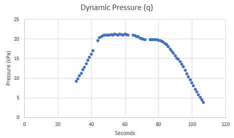
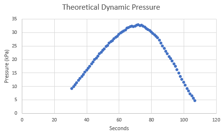

# Max-Q-Analysis

## Summary
I noticed that during falcon 9 launches they call out a throttle down as the rocket approaches Max-Q (Maximum Dynamic pressure). I was curious to see to what extent the throttle down affected the experienced Max-Q.

For this project I recorded and analyzed flight telemetry data of [the crew 5 launch](https://youtu.be/5EwW8ZkArL4?t=12600 ). I gave a presentation on this during my math seminar course at Edinboro during my Fall 2022 semester.

These were the results I obtained

A very satisfying confirmation of the theoretical Max-Q curve which I produced is that the max of the data occurs at T+73 seconds into flight, which is exactly when the Max-Q callout happens in the flight.

You may be curious about the "Theoretical Q" series, and how I was able to calculate Actual Q. See below for the explanation!

## Explanation
### Data Source
SpaceX falcon 9 launches provide velocity and altitude data in their livestreams. I went through each second of the [Crew 5 flight](https://youtu.be/5EwW8ZkArL4?t=12600 ) and recorded this data in excel. I did this by using Youtube's 5 second scrub feature. The telemetry starts being shown at T+31s.

There are a few times where the telemetry data is obscured by other flight updates, but this only caused a few small gaps in the data.

### Acceleration

I took the difference of velocity to obtain acceleration. You can clearly see the throttle down and throttle back up. 

For the theoretical-Q part of the model I wanted to see what would happen if the Falcon 9 had not throttled down. Therefore I removed the throttle-down portion of the data, and made a model for velocity based off of a degree-2 interpolation of the resulting acceleration curve.

### Air Density Estimation
The other aspect of the Dynamic Pressure equation is air density. Air density can be fairly easily estimated using altitude.

I used this equation which I [obtained from wikipedia](https://en.wikipedia.org/wiki/Density_of_air#Variation_with_altitude). The associated constants that I used are also listed on that page.

The temperature model which it is based off of can only be trusted up to 18km, however it works well enough for this application.

### Dynamic Pressure

The equation for dynamic pressure of fluid flow is $q = \frac{1}{2}\rho *v^{2}$
where $\rho$ is air density, and $v$ is velocity.

I then calculated dynamic pressure using the real velocity data,

and the theoretical velocity, had the Falcon-9 not throttled down.

Combining these graphs and throwing in the acceleration curve gives you a very cool graph!

Notice how the difference between the theoretical Max-Q and experienced Max-Q is about 13kPa. That's about a 33% reduction in peak dynamic pressure by simply throttling down!

This really helps to fully understand the reason for the throttle down. Had they not done so, the booster would need to be built to withstand ~50% more vertical loading, which would surely result in a heavier dry mass of the Falcon 9 booster.

## Conclusion

This was a very enjoyable exercise in data acquisition and analysis. I think it is very cool that SpaceX shows telemetry data for their launches. I also think it is super cool that with just velocity and altitude you can estimate something as seemingly complex as Max-Q.

If you would like to see the data, the [excel file is included](Crew%205%20launch%20data.xlsx) in this github Repo. [The powerpoint I presented with is also here](Mathematics%20of%20Getting%20into%20Orbit.pptx).

In the rest of my powerpoint presentation, since I was presenting to fellow math majors, I discussed the importance of dry mass reduction, differences in engine performance, and other considerations involved in getting into Low-Earth-Orbit. 
